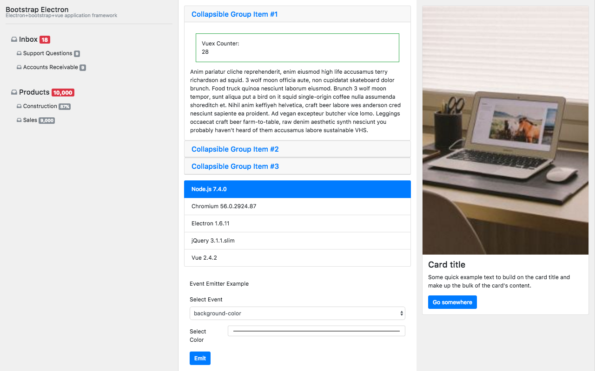
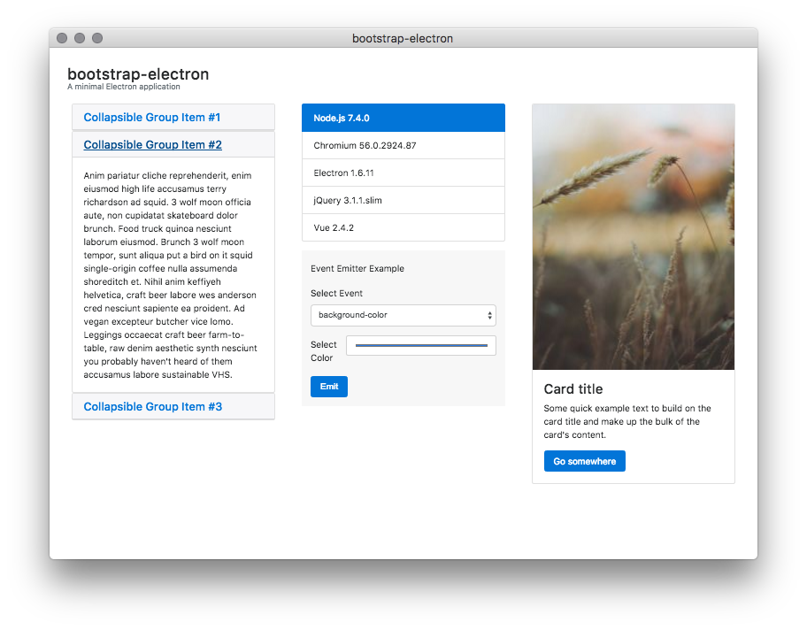

# Bootstrap Electron

Boilerplate that combines the Bootstrap GUI and Electron Application.




## Usage

Clone or copy https://github.com/fantasyui-com/bootstrap-electron
make changes as needed and publish to npm registry under your own name.

Execute with ```epx name-of-your-application```

## Using this project

```
  npm i -g epx;
  epx bootstrap-electron

```
